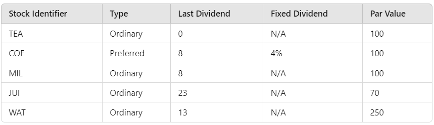
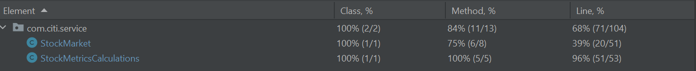

# SIMPLE STOCK MARKET APPLICATION

## Overview

This Stock Market application simulates basic operations such as calculating the dividend yield, P/E ratio, recording
trades, calculating volume-weighted stock price, and computing the all-share index for a given set of stocks. The
application uses Java and JUnit for implementation and testing.

## Project Structure

```bash

StockMarketApp
├── pom.xml
├── src
│   ├── main
│   │   └── java
│   │       └── com.citi
│   │               ├── model
│   │               │   ├── Stock.java
│   │               │   ├── StockType.java
│   │               │   ├── Trade.java
│   │               │   ├── TradeAction.java
│   │               └── service
│   │                   ├── StockMarket.java
│   │                   ├── StockMetricsCalculations.java
│   │                   └── StockMarketApplication.java
│   └── test
│       └── java
│           └── com.citi.service
│                        └── StockMetricsCalculationsTest.java

```

## Model Classes

### Stock

Represents a stock with the following properties:

- `stockIdentifier`: The stock symbol (e.g., TEA, COF)
- `type`: The type of stock (Ordinary or Preferred)
- `lastDividend`: The last dividend value
- `fixedDividend`: The fixed dividend rate (for Preferred stocks)
- `parValue`: The par value of the stock
- `stockPrice`: The base price of the stock

### Trade

Represents a trade with the following properties:

- `timestamp`: The timestamp of the trade
- `tradeQuantity`: The quantity of shares traded
- `tradeAction`: The trade action (buy or sell)
- `tradedPrice`: The trade price

### Assumptions

The following assumptions are made while implementing the solution

- BigDecimal is used as a data type for stock price, dividend values, par value and trade price as BigDecimal gives high
  precision and used widely over financial calculations
- For P/E ratio calculation, the Earnings Per Share is substituted with Last Dividend per the problem statement from the
  generic P/E formula
- The stock Symbols used for the problem - TEA, COF, MIL, JUI, WAT
- The trade price and base price for the stock is assumed to be + or - 20 of the given par value
- Past 30 minutes trades are captured to simulate real time trading
- The results of the calculations are rounded up and scaled to 2 decimal precision for simplicity

### Steps to run the application

- Open the project as a maven application (if using Intellij or Eclipse IDE open the project using pom.xml and then
  execute mvn clean install)
- The project consists of StockMarketApplication class that contains the main method
- Execute or Run the main method to simulate the simple stock market or JUnit tests for specific scenarios
- The data is added as value initializations instead of user prompt input (due to more data points to be feeded in)
- Trades and stock prices are generated randomly
- The Dividend Yield, P/E Ratio, Volume Weighted Stock Price are printed for each stock symbol in the console
- The All Share Index for the given stock table is calculated and printed in the console
- Below is the given sample stock data
- 

### Test Coverage

- JUnit 5 tests are added for the service layer classes
- Below are the coverage details
- 

## Java Docs

The Java Docs have been added at the class level